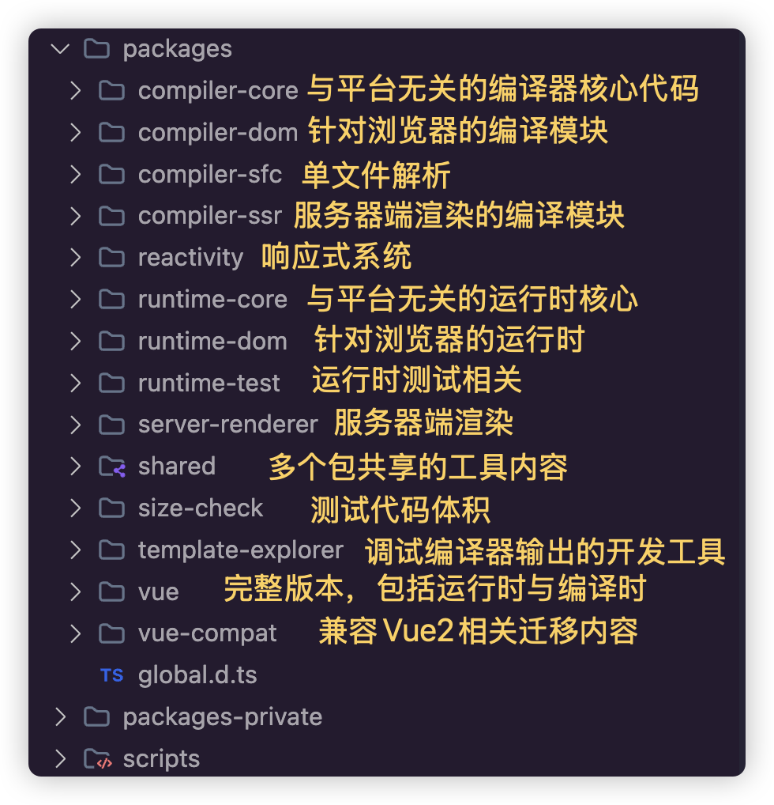

{/* @format */}

## Vue 的设计思想

在具体讲解 Vue3 源码之前，其实最重要的，大家需要对整个 Vue3 的设计有一个整体上的认知，为什么要设计成这个样子，具体的原因是什么，这样我们才会对框架的定位和方向有一个全局性的了解，在学习后续的模块的时候，才会了解为什么要做这样的的模块设计和拆分，不然我们就会被代码的细节给困住，看不清楚全貌

### 命令式和声明式

首先什么命令式的代码，比如我们在使用原生 DOM 的时候要实现一个元素点击的功能，会写出下面的代码：

```typescript
const div = document.querySelector("#layer"); // 获取div元素
div.innerText = "hello world"; // 设置文本内容
div.addEventListener("click", () => {
  alert("hello");
}); // 绑定点击事件
```

代码描述的过程，和我们思维的顺序是同步的，一步一步去实现，**做事的过程是清晰的**

声明式框架和命令式不一样，很明显**命令式更加关注过程**，而**声明式框架关注的是结果**，比如，上面的代码，使用 vue 去实现，可能就是下面这个样子

```typescript
<div @click="() => alert('hello')">hello world</div>
```

通过这一行代码，我们很明显的可以看出代码想干什么事情，我们知道了要实现元素点击事件的这个结果，但是至于底层是怎么实现这个结果的，我们并不需要关心。

其实很明显，对于平时开发来说，第二种方式大大的减少程序员的心智负担。

当然要注意一个问题，我这里并不是说声明式的代码方式就比命令式的代码好，很多时候，是框架开发者的一种选择和一种权衡。

命令式代码麻烦，但是实现过程清晰，声明式代码简单，但是实现过程对开发者而言不可见，对框架掌握不熟悉的开发者，如果出现了错误，可能反而会不知道如何处理。

当然我也说了这事一种权衡，一两段这种代码我们会觉得命令式代码更符合我们的思维过程，但是当我们代码越来越多，工程越来越臃肿，事情又会转向另外一种极端，**命令式代码的可维护性会变得非常困难**

所以，这也是 vue 采用声明式代码的一种权衡抉择，当然了，为了让开发人员对框架更加可控，vue 也留出了让开发人员自己去实现的一些 API

### 采用虚拟 DOM

正是由于使用了声明式代码的方式，在处理元素的挂载或者更新的时候，很明显是更加费事的，如果原生 DOM 需要更新元素节点内容，可能只需要执行

```typescript
div.textContent = "hello vue3";
```

但是声明式代码由于是自定义的，我们还需要找出和原来代码的差异性，然后再进行更新操作。

直接的 DOM 操作，无论是查看，比较，删除或者移动等等，都会对浏览器性能有比较大的消耗

所以，Vue 使用虚拟 DOM 的方式，其实也就是大家熟知的 js 对象。下面就是 Vue3 代码中初始化的 vnode 对象

```typescript
const vnode = {
  __v_isVNode: true,
  __v_skip: true,
  type,
  props,
  key: props && normalizeKey(props),
  ref: props && normalizeRef(props),
  scopeId: currentScopeId,
  slotScopeIds: null,
  children,
  component: null,
  suspense: null,
  ssContent: null,
  ssFallback: null,
  dirs: null,
  transition: null,
  el: null,
  anchor: null,
  target: null,
  targetStart: null,
  targetAnchor: null,
  staticCount: 0,
  shapeFlag,
  patchFlag,
  dynamicProps,
  dynamicChildren: null,
  appContext: null,
  ctx: currentRenderingInstance,
};
```

通过使用对象的方式来描述真实 DOM，在处理的时候，先对 JS 对象进行比较，发现有不同的地方，然后再去操作真实 DOM，尽可能的减少真实 DOM 的操作。

其实通过上面简单描述，大家也知道了有了虚拟 DOM 之后反而多加了一层操作，在性能上其实是要差与原生 DOM 的操作的。

但是这同样需要权衡，需要知道在什么样的代码环境之下。当代码量达到一定程度之后，我们并不能简单以理论化的数据来衡量，还需要对比开发速度，代码量，代码的整体架构以及代码修改的情况。

在 Vue3 的相关算法的加持下，虚拟 DOM 对性能的影响已经降低到很小，但是对比可维护性和对开发人员的心智负担的影响，比原生 DOM 操作提高的非常非常多。所以这也是一种权衡的选择

### 运行时和编译时

正是由于使用虚拟 DOM 和声明式代码，所以，什么时候去转换就是一个问题，什么意思呢？

由于有了虚拟 DOM，我们肯定需要调用相关的渲染方法，将虚拟 DOM 渲染成真实 DOM，这样最终才能显示出来

但是写代码的时候又是声明式的，所以还需要将模板想办法转换成虚拟 DOM

vue3 为了性能和灵活性的考虑，采用了运行时+编译时的架构。使用编译时将声明式的 HTML 标签编译成树状结构的数据对象，也就是虚拟 DOM。然后在运行时，调用相关渲染函数，将虚拟 DOM 渲染成真实 DOM

## Vue 源码

直接进入 vuejs 在 github 上的地址：https://github.com/vuejs/core，源码是Monorepo的结构



其实从 Vue3 的源码中可以看出，整个源码的核心四大块：

- 响应式系统
- 运行时
- 编译时
- 服务器端渲染(略)

由于现在版本很高，Vue3 的边界，代码的完整度，TS 类型的完整度，各个大佬提供的 Issues 各种各样的代码都已经集成在里面，如果我们希望直接读取现在的代码学习源码的话，就太难了，我们可以直接回退到一开始 vue3 刚刚发布的代码版本，看看 vue3 一开始的样子：

可以点击 Tags 标签，找到对应的链接https://github.com/vuejs/core/tags?after=v3.0.0

并且找到对应的 commit hash --- d8c1536

当然，直接通过 git 命令获取

```git
git rev-list --max-count=1  v3.0.0

d8c1536ead56429f21233bf1fe984ceb3e273fe9
```

通过 commit hash，我们可以 checkout 到 v3.0.0 版本

```git
git checkout d8c1536ead56429f21233bf1fe984ceb3e273fe9
```

在这个分支下面，可以很明显的看出代码量的区别

## Ecma262 文档

地址：https://github.com/tc39/ecma262

克隆后，执行`npm install`来安装环境。然后可以执行`npm run build`来构建。结果将显示在`out`目录中。
