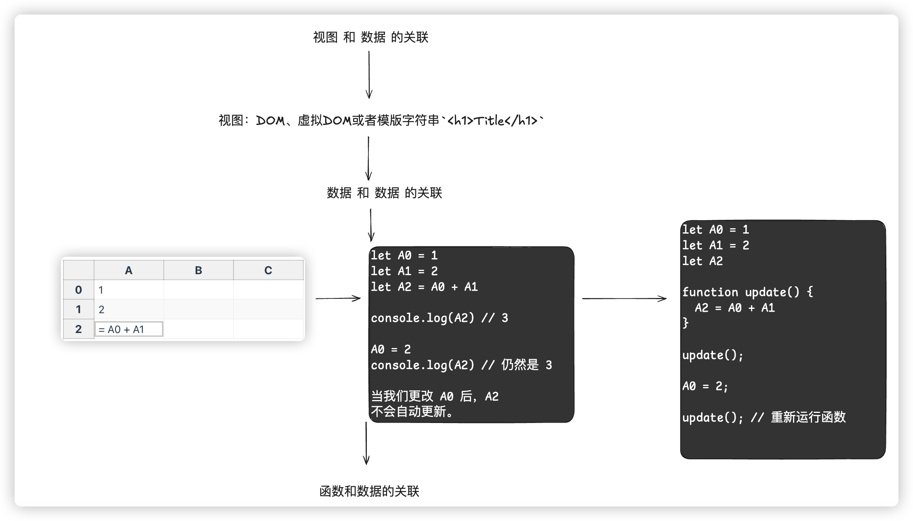
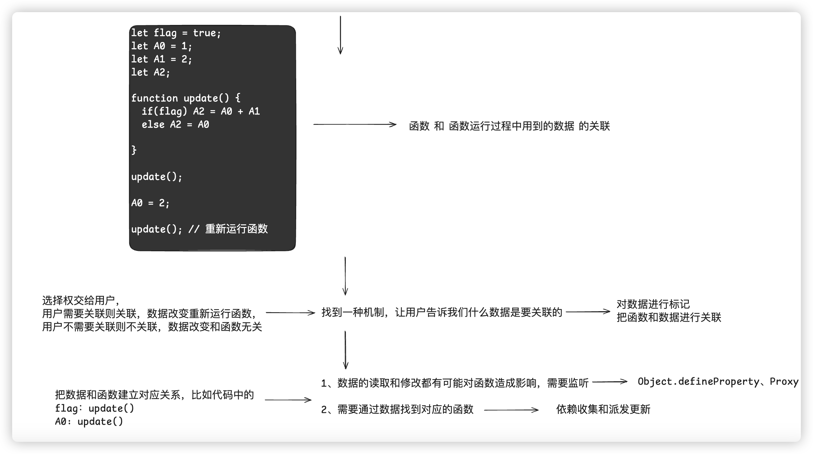

## AI 总结

> **1. 响应式系统的定义及其核心构成**
>
> 响应式系统本质上是一种程序设计范式，其主要特征在于能够依据数据变动自动作出响应。此范式的核心在于数据与其所依赖的函数（如视图更新函数）之间建立关联；当数据发生变更时，相关函数将自动执行。
>
> **2. JavaScript 中可用于实现响应式的应用程序接口及其局限性**
>
> 在 JavaScript 中，`Object.defineProperty` 与 `Proxy` 可被用于实现响应式。
>
> 然而，这二者均存在固有的局限性：
>
> - `Object.defineProperty` 仅能监听对象的属性，无法直接监听对象本身；因此，若要实现对整个对象的监听，则必须递归地遍历其属性。
> - `Proxy` 虽然能够监听对象自身，但无法直接应用于原始数据类型。
>
> **3. 纯函数与副作用函数的界定及其在响应式系统中的作用**
>
> 在程序设计中，函数可被区分为纯函数与副作用函数。
>
> - **纯函数：** 此类函数的输出仅取决于其输入，不产生任何副作用。例如：
>
>   ```javascript
>   function add(a, b) {
>     return a + b;
>   }
>   ```
>
> - **副作用函数：** 此类函数在执行过程中会对外部状态或环境产生影响。例如：
>
>   ```javascript
>   function updateDOM() {
>     document.getElementById("layer").innerHTML = data.value;
>   }
>   ```
>
> - **作用：** 响应式系统通常倾向于避免使用副作用函数，而尽可能采用纯函数，以提升代码的可预测性与可维护性。副作用函数需要由响应式系统进行妥善管理，以确保其在数据变更时能够安全执行。
>
> **4. 依赖收集与触发的原理**
>
> 依赖收集与触发是响应式系统运作的关键机制。
>
> - **依赖收集：** 当数据被读取时，当前正在执行的函数（即副作用函数）将被收集至一个“容器”（例如 `Set` 对象）中；此过程即被称为依赖收集。
> - **触发：** 当数据被修改时，先前从“容器”中收集的函数将被取出并执行；此过程即被称为触发。
>
> **例证：** 在本文提供的示例代码中，`effect` 函数读取了 `proxy.name`，因此 `effect` 函数被收集至 `buckets` 中。当 `proxy.name` 发生变更时，`buckets` 中的 `effect` 函数得以执行，从而使 `layer` 元素的内容得到更新。
>
> **5. JavaScript 中对象的分类及其区别**
>
> 在 JavaScript 中，对象可被划分为常规对象 (ordinary object) 与异质对象 (exotic object) 两类。
>
> **区别：**
>
> - **常规对象：** 此类对象的行为严格遵循 ECMAScript 规范所定义的标准；其内部方法的实现亦完全符合规范的规定。
> - **异质对象：** 此类对象的行为具有特殊性，其内部方法的实现与规范的规定存在差异；例如，数组、字符串以及 `Proxy` 等均属于异质对象。
>
> **6. 对象内部方法的概念以及函数对象所独有的内部方法**
>
> 对象内部方法指的是当对某一对象执行操作时，在引擎内部被调用的方法；此类方法对于 JavaScript 使用者而言通常是不可见的。ECMAScript 规范采用 `[[xxx]]` 符号来表示内部方法。
>
> **函数对象所独有的内部方法：** `[[Call]]` 与 `[[Construct]]`。
>
> - `[[Call]]`：当函数被调用时执行。
> - `[[Construct]]`：当使用 `new` 关键字调用构造函数时执行。
> - 普通对象不具备 `[[Call]]` 与 `[[Construct]]` 方法，因此无法作为函数被调用，亦无法与 `new` 运算符一同使用。
>
> **7. `Proxy` 对象的本质及其“透明性”的含义**
>
> `Proxy` 对象本质上是一种异质对象，可用于拦截对其他对象的操作，并允许开发者自定义这些操作的行为。
>
> **透明性：** 此性质指的是，当通过代理对象执行某一操作时，若该代理对象未定义相应的拦截函数，则此操作将直接传递至原始对象。换言之，在未定义拦截器的情况下，对代理对象执行操作，与直接对原始对象执行操作，其效果是相同的。
>
> **8. `Proxy` 对象的优势及其相对于 `Object.defineProperty` 的改进之处**
>
> `Proxy` 对象相较于 `Object.defineProperty` 具有诸多优势：
>
> - 可以代理整个对象，而不仅仅限于对象的属性。
> - 可以拦截更多种类的对象操作，例如 `get`、`set`、`has`、`deleteProperty` 以及 `ownKeys` 等。
> - 无需遍历对象的全部属性，因此在性能上更具优势。
> - 可以更为便捷地实现对数组、函数等对象的代理。

## 响应式的基本分析





其实现在的事情就非常的简单：

1、数据的读取和修改都需要对函数有影响，那 JS 原生提供给我们的就只有两个 API。Object.defineProperty 或者 Proxy

> **注意：**无论是使用 Object.defineProperty，或者是 Proxy，都只能针对对象

2、数据和函数之间需要建立关联，怎么去建立这个关联？

### **纯函数 (Pure Function)**

**定义**：
纯函数是满足以下两个条件的函数：

1. **确定性**：相同的输入永远会返回相同的输出。
2. **无副作用**：函数的执行不会影响外部环境，也不会依赖外部状态（例如修改全局变量、调用外部服务等）。

**特点**：

- 不依赖函数外部的状态或环境。
- 不会修改外部变量、对象或其他数据结构。
- 容易测试和调试，因为它的行为完全由输入决定。

**示例**：

```js
// 纯函数
function add(a, b) {
  return a + b; // 输出仅依赖输入，没有其他副作用
}

// 非纯函数 (修改了外部变量)
let count = 0;
function increment() {
  count++; // 修改了外部的 count 变量
  return count;
}
```

---

### **副作用函数 (Side Effect Function)**

**定义**：
副作用函数是指在执行过程中对外部环境产生影响或依赖外部状态的函数。

**副作用的常见形式**：

- 修改全局变量或参数。
- 进行 I/O 操作（如网络请求、读写文件、控制台输出）。
- 操作 DOM。
- 触发其他函数（尤其是有副作用的函数）。
- 依赖不受控制的外部状态（如全局变量或外部 API）。

**特点**：

- 可能导致不可预测的行为，尤其在多线程或异步环境下。
- 更难以测试，因为需要模拟外部状态。

**示例**：

```js
let globalCount = 0;

// 副作用函数
function incrementGlobalCount() {
  globalCount++; // 修改了全局变量，产生副作用
}
```

**基本代码：**

**页面：**

```typescript
<!DOCTYPE html>
<html lang="en">
<head>
  <meta charset="UTF-8">
  <meta name="viewport" content="width=device-width, initial-scale=1.0">
  <title>Document</title>
</head>
<body>
  <div id="layer"></div>
  <button id="btn">修改</button>
</body>
<script src="index.js"></script>
</html>
```

**index.js**

```typescript
const layer = document.querySelector("#layer");
const btn = document.querySelector("#btn");

const obj = {
  name: "张三",
  age: 18,
};

const buckets = new Set();

const handler = {
  get(target, key, receiver) {
    buckets.add(effect);
    const result = Reflect.get(target, key, receiver);
    return result;
  },
  set(target, key, value, receiver) {
    const result = Reflect.set(target, key, value, receiver);
    buckets.forEach((effect) => effect());
    return result;
  },
};

const proxy = new Proxy(obj, handler);

function effect() {
  layer.innerHTML = proxy.name;
}

effect(); // 收集依赖

btn.addEventListener("click", () => {
  proxy.name = "李四"; // 触发更新
});
```

## 对于 Proxy 的深入理解

### 到底什么是对象？

我们经常听到这样的说法:“**JavaScript 中一切皆对象**”。那么，到 底什么是对象呢?这个问题需要我们查阅 ECMAScript 规范才能得到答 案。实际上，根据 ECMAScript 规范，在 JavaScript 中有两种对象，其 中一种叫作**常规对象(ordinary object)**，另一种叫作**异质对象(exotic object**)(**ECMA262 第十章**)

那关键是什么是**常规对象**，什么是**异质对象**？

我们知道，在 JavaScript 中，函数其实也是对象。假设给出一个对 象 obj，如何区分它是普通对象还是函数呢?实际上，在 JavaScript 中，对象的实际语义是由对象的 (internal method)指定的。 所谓内部方法，指的是当我们对一个对象进行操作时在引擎内部调用的方法，这些方法对于 JavaScript 使用者来说是不可见的。

比如当我们访问

```typescript
obj.name;
```

引擎内部会调用 `[[Get]]` 这个内部方法来读取属性值。`ECMAScript`规范中使用 **[[xxx]]**来代表**内部方法或内部插槽**。当然，一个对象不仅部署了 `[[Get]]` 这个内部方法

**ECMA262 --- 6.1.7.2 Object Internal Methods and Internal Slots 对象内部方法和内部插槽**

**Table 4: Essential Internal Methods**

| Internal Method       | Signature                                                                                           | Description                                                                                                                                                                                                                                                                   |
| --------------------- | --------------------------------------------------------------------------------------------------- | ----------------------------------------------------------------------------------------------------------------------------------------------------------------------------------------------------------------------------------------------------------------------------- |
| [[GetPrototypeOf]]    | ( ) **→** Object \| Null                                                                            | Determine the object that provides inherited properties for this object. A null value indicates that there are no inherited properties.                                                                                                                                       |
| [[SetPrototypeOf]]    | (Object \| Null) **→** Boolean                                                                      | Associate this object with another object that provides inherited properties. Passing null indicates that there are no inherited properties. Returns true indicating that the operation was completed successfully or false indicating that the operation was not successful. |
| [[IsExtensible]]      | ( ) **→** Boolean                                                                                   | Determine whether it is permitted to add additional properties to this object.                                                                                                                                                                                                |
| [[PreventExtensions]] | ( ) **→** Boolean                                                                                   | Control whether new properties may be added to this object. Returns true if the operation was successful or false if the operation was unsuccessful.                                                                                                                          |
| [[GetOwnProperty]]    | (propertyKey) **→** Undefined \| [Property Descriptor](#sec-property-descriptor-specification-type) | Return a [Property Descriptor](#sec-property-descriptor-specification-type) for the own property of this object whose key is propertyKey, or undefined if no such property exists.                                                                                            |
| [[DefineOwnProperty]] | (propertyKey, PropertyDescriptor) **→** Boolean                                                     | Create or alter the own property, whose key is propertyKey, to have the state described by PropertyDescriptor. Return true if that property was successfully created/updated or false if the property could not be created or updated.                                        |
| [[HasProperty]]       | (propertyKey) **→** Boolean                                                                         | Return a Boolean value indicating whether this object already has either an own or inherited property whose key is propertyKey.                                                                                                                                               |
| [[Get]]               | (propertyKey, Receiver) **→** _any_                                                                 | Return the value of the property whose key is propertyKey from this object. If any ECMAScript code must be executed to retrieve the property value, Receiver is used as the this value when evaluating the code.                                                              |
| [[Set]]               | (propertyKey, value, Receiver) **→** Boolean                                                        | Set the value of the property whose key is propertyKey to value. If any ECMAScript code must be executed to set the property value, Receiver is used as the this value when evaluating the code. Returns true if the property value was set or false if it could not be set.  |
| [[Delete]]            | (propertyKey) **→** Boolean                                                                         | Remove the own property whose key is propertyKey from this object. Return false if the property was not deleted and is still present. Return true if the property was deleted or is not present.                                                                              |
| [[OwnPropertyKeys]]   | ( ) **→** [List](#sec-list-and-record-specification-type) of [property keys](#sec-object-type)      | Return a [List](#sec-list-and-record-specification-type) whose elements are all of the own [property keys](#sec-object-type) for the object.                                                                                                                                  |

包括 `[[Get]]` 在内，**一个对象必须部署 `11` 个必 要的内部方法**。

具体方法对象内部方法的说明：**ECMA262 --- 10.1 Ordinary Object Internal Methods and Internal Slots**

内部方法之外，还有两个额外的必要方法

**Table 5: Additional Essential Internal Methods of Function Objects**

| Internal Method | Signature                                                                         | Description                                                                                                                                                                                                                                                                                                                                                                                                                                                                                                                                                                                                                                                           |
| --------------- | --------------------------------------------------------------------------------- | --------------------------------------------------------------------------------------------------------------------------------------------------------------------------------------------------------------------------------------------------------------------------------------------------------------------------------------------------------------------------------------------------------------------------------------------------------------------------------------------------------------------------------------------------------------------------------------------------------------------------------------------------------------------- |
| [[Call]]        | (_any_, a [List](#sec-list-and-record-specification-type) of _any_) **→** _any_   | Executes code associated with this object. Invoked via a function call expression. The arguments to the internal method are a this value and a [List](#sec-list-and-record-specification-type) whose elements are the arguments passed to the function by a call expression. Objects that implement this internal method are _callable_.                                                                                                                                                                                                                                                                                                                              |
| [[Construct]]   | (a [List](#sec-list-and-record-specification-type) of _any_, Object) **→** Object | Creates an object. Invoked via the `new` operator or a `super` call. The first argument to the internal method is a [List](#sec-list-and-record-specification-type) whose elements are the arguments of the [constructor](#constructor) invocation or the `super` call. The second argument is the object to which the `new` operator was initially applied. Objects that implement this internal method are called _[constructors](#constructor)_. A [function object](#function-object) is not necessarily a [constructor](#constructor) and such non-[constructor](#constructor) [function objects](#function-object) do not have a [[Construct]] internal method. |

具体关于`[[Call]]`与`[[Construct]]`的说明在**ECMA262 --- 10.2 ECMAScript Function Objects**

**[[Call]]** --- **10.2.1 [[Call]] ( thisArgument, argumentsList )**

**[[Construct]]** --- **10.2.2 [[Construct]] ( argumentsList, newTarget )**

如果一个对象需要作为函数调用，那么这个对象就必须部署内部 方法 `[[Call]]`。

> 也就是说：
>
> **函数对象会 部署内部方法 `[[Call]]`，而普通对象则不会**

那总结来说，什么是常规对象？**满足以下三点就是常规对象**

- 对于**Table 4: Essential Internal Methods** 列出的内部方法，**必须使用 ECMA 规范 10.1.x 节**给出 的定义实现
- 对于**内部方法 [[Call]]**，**必须使用 ECMA 规范 10.2.1 节**给出的 定义实现
- 对于**内部方法 [[Construct]]**，**必须使用 ECMA 规范 10.2.2 节** 给出的定义实现

> 其实简单来说，我们一般情况下，自己通过字面量形式或者 class 类的形式创建的对象，都是常规对象，因为都是严格按照上面的标准所执行的。

但是，**我们常用的一些内置对象，其实都算是异质对象**，比如，**数组，字符串，Error，Arguments，Map，Set，Promise，Date**等等，都有自己对于 10.1.x 章节规定的方法延伸扩展。

**数组（Array）**是异质对象，因为它具有一些特殊行为。例如，数组的 `length` 属性会根据数组内容的变化动态调整；数组的索引属性（如 `arr[0]`）的行为也不同于常规对象，尤其是在增加和删除元素时。

**字符串（String）**同样是异质对象。尽管字符串表现为类数组的对象，但其长度是固定的，且其元素（字符）是只读的，无法像普通对象属性那样修改。此外，字符串的下标访问（`str[0]`）与普通对象属性访问的行为不同

.......

当然。**Proxy 肯定也是异质对象**，而且在 ECMA262 中，有专门关于 Proxy 对象内部方法的处理

**10.5 Proxy Object Internal Methods and Internal Slots**

**Table 34: Proxy Handler Methods**

| Internal Method       | Handler Method             |
| --------------------- | -------------------------- |
| [[GetPrototypeOf]]    | `getPrototypeOf`           |
| [[SetPrototypeOf]]    | `setPrototypeOf`           |
| [[IsExtensible]]      | `isExtensible`             |
| [[PreventExtensions]] | `preventExtensions`        |
| [[GetOwnProperty]]    | `getOwnPropertyDescriptor` |
| [[DefineOwnProperty]] | `defineProperty`           |
| [[HasProperty]]       | `has`                      |
| [[Get]]               | `get`                      |
| [[Set]]               | `set`                      |
| [[Delete]]            | `deleteProperty`           |
| [[OwnPropertyKeys]]   | `ownKeys`                  |
| [[Call]]              | `apply`                    |
| [[Construct]]         | `construct`                |

简单来说，比如下面的代码：

```typescript
const p = new Proxy(obj,{...});
p.foo
```

实际上，**引擎会调用部署在代理对象 `p` 上的内部方法 `[[Get]]`**，这其实和普通对象没有太大区别。它们的区别在于对于 内部方法 `[[Get]]` 的实现。

普通对象和 Proxy 对象都部署了 `[[Get]]` 这个内部方法，但它们的逻辑是不同的，普通对象部署的 `[[Get]]` 内部方法的逻辑是由 **ECMA 规范的 10.1.8 节**定义的，而 Proxy 对象部署的 `[[Get]]` 内部方法的逻辑是由 **ECMA 规范的 10.5.8 节**来定义的

如果在创建代理对象时没有指定对应的拦截函数，例如**没有指定 `get()` 拦截函数**，那么当我们通过代理对象访问属性值时，**代理对象的内部方法 `[[Get]]` 会调用原始对象的内部方法 `[[Get]]` 来获取属性值**，这其实就是代理透明性质

> 也就是说：
>
> **创建代理对象时指定的拦截函数，实际 上是用来自定义代理对象本身的内部方法和行为的，而不是用来指定被代理对象的内部方法和行为的**
