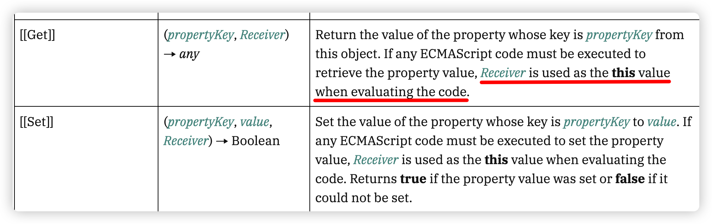

## 边界问题的处理

### 1、需要判断传入的参数是否是对象。

虽然有 TS 帮我们做参数限定，但是这只是在编译时，编译之后的 js 还是需要我们判断传入的参数是否是一个对象

```typescript
// 自定义守卫是指通过 `{形参} is {类型}` 的语法结构，
// 来给返回布尔值的条件函数赋予类型守卫的能力
// 类型收窄只能在同一的函数中，如果在不同的函数中就不起作用。
// 如果判断val is object，下面的val.then会报错，object上没有then方法
export const isObject = (val: unknown): val is Record<any, any> => {
  return val !== null && typeof val === "object";
};

export const isArray = Array.isArray;

export const isString = (val: unknown): val is string => {
  return typeof val === "string";
};

export const isFunction = (val: unknown): val is Function => {
  return typeof val === "function";
};

export const isPromise = <T = any>(val: unknown): val is Promise<T> => {
  return isObject(val) && isFunction(val.then) && isFunction(val.catch);
};
```

```typescript
export function reactive<T extends object>(target: T): T;
export function reactive(target: object) {
  // 如果不是对象，直接返回
  if (!isObject(target)) {
    console.error("target is not object");
    return target;
  }
  ......
}
```

### 2、如果对象已经被代理 Proxy 了，无需再次被代理

如果再此被代理，同一个原始对象，就生成了两个不同的 Proxy 对象，而且两个 Proxy 对象如果去比较的话，还是不相等的

```typescript
import { reactive } from "./reactive";
const obj = {
  a: 1,
  b: 2,
};

const state1 = reactive(obj);
const state2 = reactive(obj);

console.log(state1 === state2); // false
```

可以将已经生成的 Proxy 对象保存在 WeakMap 中，如果有，直接取出，没有就 set 到 WeakMap 中

> **题外话：**WeakMap 与 Map 的区别
>
> 1. **键的类型**
>
> - **Map**：键可以是任何类型的值（包括对象、原始类型）。
> - **WeakMap**：键必须是对象（不能是原始类型如字符串、数字等）。如果尝试使用非对象类型作为键，将抛出错误。
>
> 2. **垃圾回收（Garbage Collection）**
>
> - **Map**：键值对中的键和值是强引用的，只要键存在，值就不会被垃圾回收机制回收。
> - **WeakMap**：键是弱引用的，也就是说，如果没有其他对该键对象的引用，该对象将被垃圾回收机制回收，一旦键被回收，对应的值也会被自动删除。
>
> 3. **枚举性**
>
> - **Map**：你可以通过迭代或者使用方法如 `Map.prototype.forEach()` 来枚举 `Map` 中的所有键值对。
> - **WeakMap**：不可枚举，无法迭代其键值对。`WeakMap` 没有暴露任何方法来获取所有的键值对。
>
> 使用 `WeakMap` 的好处
>
> 1. **内存优化**：由于 `WeakMap` 中的键是弱引用的，当键对象不再被使用时，垃圾回收器可以自动清理 `WeakMap` 中的条目，避免了内存泄漏。这对于缓存、存储临时数据、或者与 DOM 相关的操作尤其有用。
> 2. **提高安全性**：由于 `WeakMap` 的键值对是不可枚举的，这使得它成为存储私有数据的理想选择，避免数据被外部代码遍历或访问。

```typescript
export const targetMap = new WeakMap<object, any>();

export function reactive<T extends object>(target: T): T;
export function reactive(target: object) {
  // 如果不是对象，直接返回
  if (!isObject(target)) {
    console.error("target is not object");
    return target;
  }

  // 如果已经代理过了，就不要再代理了
  if (targetMap.has(target)) {
    return targetMap.get(target);
  }

  const proxy = new Proxy(target, {
    get(target, key) {
      // TODO: 收集依赖 哪个函数用到了哪个对象的哪个属性
      track(target, key);
      // 返回对象的相应属性值，推荐使用 Reflect.get
      const result = Reflect.get(target, key);
      return result;
    },
    set(target, key, value) {
      // TODO: 触发更新
      trigger(target, key);
      // 设置对象的相应属性值，推荐使用 Reflect.set
      const result = Reflect.set(target, key, value);
      return result;
    },
  });

  targetMap.set(target, proxy);

  return proxy;
}
```

### 3、如果是 Proxy 代理对象，无需再次被代理

也就是说像下面这种情况：

```typescript
const state1 = reactive(obj);
const state2 = reactive(state1);
```

其实问题的关键就是在于怎么知道传入的 state1 是一个 Proxy 对象呢？其实很简单，如果是 Proxy 对象，那么如果访问代理对象的属性，如果有没有，始终都会到 get()方法中，而普通对象没有这个内容

```typescript
const obj = { a: 1, b: 2 };
const proxy = new Proxy(
  { a: 1, b: 2 },
  {
    get(target, key) {
      console.log("进入了get方法---", key);
      return target[key];
    },
  }
);
obj.a; // 只是打印a的值

proxy.a; // 打印111，还打印值1

proxy.c; // 就算没有c这个属性，也会进入get()方法，打印111
```

因此，利用这个特性，如果已经是 Proxy 代理对象，让他进入 get 函数，如果 key 等于某个固定的值，直接返回即可，比如：

```typescript
const proxy = new Proxy(target, {
    get(target, key, receiver) {
      // 如果访问的是ReactiveFlags.IS_REACTIVE，返回true
      if (key === "__v_isReactive") {
        return true;
      }

      track(target, key);
      const result = Reflect.get(target, key);
      console.log("result---", result)
      return result;
    },
  ......
}
```

当然，使用硬编码并不是一个好习惯，既然是 TS 的代码，可以将这些处理成枚举

```typescript
export const enum ReactiveFlags {
  SKIP = "__v_skip",
  IS_REACTIVE = "__v_isReactive",
  IS_READONLY = "__v_isReadonly",
  RAW = "__v_raw",
}

export interface Target {
  [ReactiveFlags.SKIP]?: boolean;
  [ReactiveFlags.IS_REACTIVE]?: boolean;
  [ReactiveFlags.IS_READONLY]?: boolean;
  [ReactiveFlags.RAW]?: any;
}

export const targetMap = new WeakMap<Target, any>();

export function reactive<T extends object>(target: T): T;
export function reactive(target: object) {
  console.log(target);
  // 如果不是对象，直接返回
  if (!isObject(target)) {
    console.error("target is not object");
    return target;
  }

  // 如果已经代理过了，就不要再代理了
  if (targetMap.has(target)) {
    return targetMap.get(target);
  }

  // 只要读到了target[ReactiveFlags.IS_REACTIVE]，就返回target
  // 因为Proxy对象直接拦截了这个属性
  if (target[ReactiveFlags.IS_REACTIVE]) {
    console.log("ts---", "进入了__v_isReactive");
    return target;
  }

  const proxy = new Proxy(target, {
    get(target, key, receiver) {
      // 如果进入到get方法，说明肯定是一个proxy代理对象
      // 如果访问的是ReactiveFlags.IS_REACTIVE，返回true
      if (key === ReactiveFlags.IS_REACTIVE) {
        return true;
      }
      // TODO: 收集依赖 哪个函数用到了哪个对象的哪个属性
      track(target, key);
      // 返回对象的相应属性值，推荐使用 Reflect.get
      const result = Reflect.get(target, key);
      return result;
    },
    set(target, key, value) {
      // TODO: 触发更新
      trigger(target, key);
      // 设置对象的相应属性值，推荐使用 Reflect.set
      const result = Reflect.set(target, key, value);
      return result;
    },
  });

  targetMap.set(target, proxy);

  return proxy;
}
```

### 4、如果原始对象中有 get，set 访问器属性怎么处理

比如下面的代码：

```typescript
const obj = {
  a: 1,
  b: 2,
  get c() {
    console.log("get c", this);
    return this.a + this.b;
  },
};

const state1 = reactive(obj);

function fn() {
  state1.c;
}

fn();
```

访问器属性 c 中，调用了 a 和 b，经过了 Proxy 代理之后的 state1，按照道理来说，函数中使用了 state1.c 那么就应该同时触发 c，a，b 的访问，但这里只触发了 c，而且我们是通过代理对象 state1 访问的 c，我们访问器属性 c 中打印的 this，可以看到还是原始对象 obj，那这是不对的。

其实 Proxy 的 get 方法还有第三个参数`recevier`，就是表示当前的 Proxy 对象，因此，我们需要通过反射函数 `Reflect.get()`，把三个参数传递进去

```typescript
const proxy = new Proxy(target, {
  get(target, key, receiver) {
    // 如果访问的是ReactiveFlags.IS_REACTIVE，返回true
    if (key === ReactiveFlags.IS_REACTIVE) {
      return true;
    }
    // TODO: 收集依赖 哪个函数用到了哪个对象的哪个属性
    track(target, key);
    // 返回对象的相应属性值，推荐使用 Reflect.get
    const result = Reflect.get(target, key, receiver);
    return result;
  },
  set(target, key, value, receiver) {
    // TODO: 触发更新
    trigger(target, key);
    // 设置对象的相应属性值，推荐使用 Reflect.set
    const result = Reflect.set(target, key, value, receiver);
    return result;
  },
});
```



### 5、原始对象的属性有嵌套的情况

```typescript
const obj = {
  a: 1,
  b: 2,
  c: {
    d: 3,
  },
};

const state1 = reactive(obj);

function fn() {
  state1.c.d;
}

fn();
```

比如上面的属性 c，还是一个对象，在 fn 中调用了 state1.c.d，但是其实只打印了调用 c 的情况。因为 c 对应的值`{d:3}`,这个对应并没有被代理，打印一下，就能看出区别：

```typescript
console.log(state1); // Proxy(Object) {a: 1, b: 2, c: {…}}
console.log(state1.c); // {d: 3}
```

那其实我们只需要在 Proxy 中，在获取属性值的时候，进行判断是不是一个对象，然后再进行递归调用就可以了

```diff
const proxy = new Proxy(target, {
  get(target, key, receiver) {
    // 如果访问的是ReactiveFlags.IS_REACTIVE，返回true
    if (key === ReactiveFlags.IS_REACTIVE) {
      return true;
    }
    // TODO: 收集依赖 哪个函数用到了哪个对象的哪个属性
    track(target, key);
    // 返回对象的相应属性值，推荐使用 Reflect.get
   const result = Reflect.get(target, key, receiver);

    // 如果是对象，递归代理
+    if (isObject(result)) {
+      return reactive(result);
+    }

    return result;
  }
  ......
}
```

这个时候再进行打印：

```typescript
console.log(state1); // Proxy(Object) {a: 1, b: 2, c: {…}}
console.log(state1.c); // Proxy(Object) {d: 3}
```

### 6、如果使用`in` 关键字检查一个属性是否存在于对象中，如何处理

```typescript
function fn() {
  console.log("a" in state1);
}
```

首先这种情况算不算是读属性呢？某个属性在不在返回 true 还是 false 的值，肯定会对程序逻辑产生影响的，比如，如果判断`'e' in state1`，可能当前对象中没有这个属性，返回 false，但是如果后面给对象添加了这么一个属性，那么触发更新再次去执行函数的时候，就会返回 true 了，所以，这种情况，我们也需要做收集。

in 关键字，在 JS 内部，触发的是`[[HasProperty]]`的内部方法，而这个内部方法刚好对应 Proxy 代理对象的`has`方法

```typescript
const proxy = new Proxy(target, {
  get(target, key, receiver) {
    // 如果访问的是ReactiveFlags.IS_REACTIVE，返回true
    if (key === ReactiveFlags.IS_REACTIVE) {
      return true;
    }
    // TODO: 收集依赖 哪个函数用到了哪个对象的哪个属性
    track(target, key);
    // 返回对象的相应属性值，推荐使用 Reflect.get
    const result = Reflect.get(target, key, receiver);

    // 如果是对象，递归代理
    if (isObject(result)) {
      return reactive(result);
    }

    return result;
  },
  set(target, key, value, receiver) {
    // TODO: 触发更新
    trigger(target, key);
    // 设置对象的相应属性值，推荐使用 Reflect.set
    const result = Reflect.set(target, key, value, receiver);
    return result;
  },
  has(target, key) {
    // 同样收集依赖
    track(target, key);
    const result = Reflect.has(target, key);
    return result;
  },
});
```

### 7、Proxy 代理中的配置项进行拆分

**baseHandlers.ts**

```typescript
import { track, trigger } from "./effect";
import { isObject } from "./utils";
import { ReactiveFlags, reactive } from "./reactive";

function get(target: object, key: string | symbol, receiver: object): any {
  // 如果访问的是ReactiveFlags.IS_REACTIVE，返回true
  if (key === ReactiveFlags.IS_REACTIVE) {
    return true;
  }
  // TODO: 收集依赖 哪个函数用到了哪个对象的哪个属性
  track(target, key);
  // 返回对象的相应属性值，推荐使用 Reflect.get
  const result = Reflect.get(target, key, receiver);

  // 如果是对象，递归代理
  if (isObject(result)) {
    return reactive(result);
  }

  return result;
}

function set(
  target: object,
  key: string | symbol,
  value: unknown,
  receiver: object
): boolean {
  // TODO: 触发更新
  trigger(target, key);
  // 设置对象的相应属性值，推荐使用 Reflect.set
  const result = Reflect.set(target, key, value, receiver);
  return result;
}

function has(target: object, key: string | symbol): boolean {
  // 同样收集依赖
  track(target, key);
  const result = Reflect.has(target, key);
  return result;
}

export const mutableHandlers: ProxyHandler<object> = {
  get,
  set,
  has,
};
```

**reactive.ts**

```typescript
import { mutableHandlers } from "./baseHandlers";
export function reactive(target: object) {
  ......
  const proxy = new Proxy(target, mutableHandlers);
	......
}
```

### 8、细化依赖收集和触发更新动作

当在函数中执行某些动作的时候，需要更细致的区分读取操作：

比如，当下面的情况出现

```typescript
const obj = {
  a: 1,
  b: 2,
  c: {
    d: 3,
  },
};

const state1 = reactive(obj);

function fn() {
  "a" in state1;
}
(state1 as any).a = 123;
fn();
```

函数中关系的是属性‘a’在 state1 中存在还是不存在。如果`'a' in state1;`是存在的。那么下面的`(state1 as any).a = 123;`这个修改操作，并不会改变`'a' in state1;`有还是没有的状况。换句话说，如果函数中仅仅只是有这么一个判断语句，这样的操作并不会对界面有任何的影响。当然，如果是有一句显示语句那结果又不一样了。

也就是说，在这种情况下，就算是 a 的值修改了，但是对函数没有影响，那就**不应该再次去执行`fn()`函数，不需要再次进行依赖收集**

那如果是下面的代码：

```typescript
const obj = {
  a: 1,
  b: 2,
  c: {
    d: 3,
  },
};

const state1 = reactive(obj);

function fn() {
  "e" in state1;
}
(state1 as any).e = 123;
fn();
```

但是，如果`(state1 as any).e = 123;`本身就是**不存在**的，那么 fn 函数中的`'e' in state1;`这个语句，就会**影响函数的结果，从而可能会影响视图显示的结果**。

也就是说，在这种情况下，**e 的值修改了，对函数是有影响**，那就**应该再次去执行`fn()`函数，进行依赖收集**

其实也就是说，我们之前在**依赖收集**和**派发更新**的时候，执行行为的划分不太细致，我们应该对执行的行为划分的更加细致，当触发某种动作的时候，才会触发相应的行为。**track**和**trigger**函数，我们需要为其添加对应的动作标志。

有了对应的标志，才可以更好的表示，当前我正在读取某个对象的某个属性，或者我正在判断某个对象是否存在。

**operations.ts**

```typescript
export const enum TrackOpTypes {
  GET = "get",
  HAS = "has",
}

export const enum TriggerOpTypes {
  SET = "set",
  ADD = "add",
  DELETE = "delete",
}
```

**effect.ts**

```typescript
import { TrackOpTypes, TriggerOpTypes } from "./operations.js";

export function track(target: object, type: TrackOpTypes, key: unknown) {
  console.log(`%c依赖收集:【${type}】${String(key)}`, "color: #f40");
}

export function trigger(target: object, type: TriggerOpTypes, key: unknown) {
  console.log(`%c派发更新:【${type}】${String(key)}`, "color: #0f0");
}
```

**reactive.ts**

```diff
function get(target: object, key: string | symbol, receiver: object): any {
  // 如果访问的是ReactiveFlags.IS_REACTIVE，返回true
  if (key === ReactiveFlags.IS_REACTIVE) {
    return true;
  }
  // TODO: 收集依赖 哪个函数用到了哪个对象的哪个属性
+  track(target, TrackOpTypes.GET, key);
  // 返回对象的相应属性值，推荐使用 Reflect.get
  const result = Reflect.get(target, key, receiver);

  // 如果是对象，递归代理
  if (isObject(result)) {
    return reactive(result);
  }

  return result;
}

function set(target: object, key: string | symbol, value: unknown, receiver: object): boolean {
  // TODO: 触发更新, 暂时动作定义为SET
+  trigger(target, TriggerOpTypes.SET, key);
  // 设置对象的相应属性值，推荐使用 Reflect.set
  const result = Reflect.set(target, key, value, receiver);
  return result;
}

function has(target: object, key: string | symbol): boolean {
  // 同样收集依赖
+  track(target, TrackOpTypes.HAS, key);
  const result = Reflect.has(target, key)
  return result;
}
```

这样编写之后，提供了相应动作，虽然我们暂时还没有细化处理，但是至少提供了相应信息，我们后面处理的之后，就可以根据动作做出相应的判断即可，比如：函数还是如下：

```typescript
function fn() {
  "a" in state1;
}
(state1 as any).a = 123;
```

这样我们执行之后，会打印出如下情况：

```typescript
派发更新:【set】a
依赖收集:【has】a
```

根据我们上面的分析，其实是不对的，如果已经有相关的属性了，修改属性，如果仅仅只是判断`'a' in state1;`是不应该在触发读取操作的重新执行的，不需要再次进行依赖收集。只是进一步操作，我们后续再讨论。

### 9、如果是遍历操作如何处理？

如果函数中直接之后遍历操作：

```typescript
function fn() {
  for (const key in state1) {
  }
}
// 或者

function fn() {
  Object.keys(state1);
}
```

可以在 ecma262 中找到对应的内部方法，发现`for-in`调用了方法`EnumerateObjectProperties`，而`EnumerateObjectProperties`中其实就调用了反射方法`Reflect.ownKeys()`。

而`Object.keys`其实差不多，只是调用了方法`EnumerableOwnProperties` ，而这个方法直接就调用了内部方法[[OwnPropertyKeys]]，代理 Proxy 中就有对应的处理方法`Proxy.ownKeys()`

**operations.ts**

```typescript
export const enum TrackOpTypes {
  GET = "get",
  HAS = "has",
  ITERATE = "iterate",
}
```

但是需要注意的是，对象迭代依赖并没有指定的具体键`key`

因此，**当你迭代一个对象的属性时**，Vue 需要追踪这个对象的所有属性（因为任何属性的**增删**都可能影响迭代的结果）。所以 Vue 使用 `ITERATE_KEY` 作为一个特殊的键，表示“**这个 `effect` 依赖于对象的所有属性**”

所以这个键，原则上我们可以使用任意的常量进行表示，比如`const ITERATE_KEY = "iterate"`，但是常量容易造成冲突，因此可以使用`Symbol`来表示唯一性，`const ITERATE_KEY = Symbol("iterate")`，既然使用`Symbol`了，有没有`iterate`这个名字来表示并不重要，因此也可以直接使用`const ITERATE_KEY = Symbol("")`来表示，其实在 Vue3 中，还有专门判断生产环境还是开发环境，`ITERATE_KEY`的赋值并不一样，不过这个在我们这里并不重要，只需要用 Symbol 来表示对象迭代依赖的标识即可

```typescript
// 用来表示对对象的“迭代依赖”的标识
export const ITERATE_KEY = Symbol("");

function ownKeys(target: object): (string | symbol)[] {
  track(target, TrackOpTypes.ITERATE, ITERATE_KEY);
  return Reflect.ownKeys(target);
}
```

### 10、新增、修改与删除不同动作的处理

首先新增和修改我们之前只是做了简单的处理，那么到底是新增还是修改的动作，我们需要区分出来，因为对于读的操作影响是不一样的。

同时，如果**修改的值其实确实有变化的时候**，才应该触发`trigger`函数，不然触发的就毫无意义，这个其实就判断一下新旧值是否一样就行了。

不过在判断新旧值是否一样的时候，我们最好使用`Object.is`函数去进行判断，而不是使用`===`或者`!==`符号去进行判断，因为有一些特殊的情况需要处理，比如**NaN 和 NaN 是相等的，+0 和-0 是不相等的**

**baseHandlers.ts**

```diff
// 注意target类型的问题
function set(target: Record<string | symbol, unknown>, key: string | symbol, value: unknown, receiver: object): boolean {

  // 判断对象是否有这个属性
+  const hadKey = target.hasOwnProperty(key)

  // 注意，如果target仅仅是object类型，target[key]如果直接这么写，ts会报错，元素隐式具有 "any" 类型
  // 当然这也和tsconfig的配置有关，如果配置了strict:true，那么ts会报错
  // 可以将target类型设置为Record<string | symbol, unknown>
+  let oldValue = target[key];

+  if (!hadKey) {
+    trigger(target, TriggerOpTypes.ADD, key);
+  }
+  else if(hasChanged(value, oldValue)) {
+    trigger(target, TriggerOpTypes.SET, key);
+  }
  // 设置对象的相应属性值，推荐使用 Reflect.set
  const result = Reflect.set(target, key, value, receiver);
  return result;
}
```

**utils.ts**

```typescript
// 通过Object.is比较可以避免出现一些特殊情况
// 比如NaN和NaN是相等的，+0和-0是不相等的
export const hasChanged = (value: any, oldValue: any): boolean =>
  !Object.is(value, oldValue);
```

当然，还有一种情况就是删除属性了，删除属性在 Proxy 代理对象中有对应的方法`deleteProperty`

**baseHandlers.ts**

```typescript
function deleteProperty(
  target: Record<string | symbol, unknown>,
  key: string | symbol
) {
  // 判断对象是否有这个属性,不然删除就没有意义
  const hadKey = target.hasOwnProperty(key);
  // 删除是否成功的结果
  const result = Reflect.deleteProperty(target, key);
  // 对象有这个属性，并且删除成功才会触发更新
  if (hadKey && result) {
    trigger(target, TriggerOpTypes.DELETE, key);
  }
  return result;
}

export const mutableHandlers: ProxyHandler<object> = {
  get,
  set,
  has,
  ownKeys,
  deleteProperty,
};
```

触发删除当然也应该有删除的相应动作：

**operations.ts**

```diff
export const enum TriggerOpTypes {
  SET = 'set',
  ADD = 'add',
+  DELETE = 'delete'
}
```

**测试：**

```typescript
const obj = {
  a: 1,
  b: 2,
  c: {
    d: 3,
  },
};

const state1 = reactive(obj);

function fn() {
  Object.keys(state1);
}

fn();
state1.a = 2;
//@ts-ignore
state1.e = 2;

// 注意：在 TypeScript 中，delete 运算符只能用于删除对象中可选的属性。
// 如果属性是必需的，TypeScript 会报错。
// 也就是说，如果你想要删除一个对象的属性，那么这个属性必须是可选的。
// 当然，我们也能简单的处理成 as any，或者加上 //@ts-ignore
//@ts-ignore
delete state1.a;

//@ts-ignore
delete state1.f;
```
