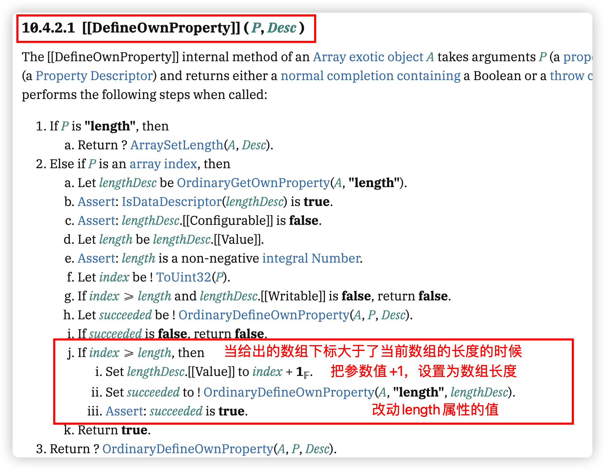

## 数组读取的相关处理

其实现在直接是通过 Proxy 做的代理，Proxy 本身就能对数组做出相应的处理，所以大部分情况下，我们不需要做过多的处理，但是呢？有时候咋一看是对的，但是对于做框架的人来说，细节就必须去留意了

```typescript
const arr1 = [3, 4, 5];
const state1 = reactive(arr1);
function fn() {
  // state1[0]
  // state1[1] = 2
  // for (let i = 0; i < state1.length; i++) {
  //   state1[i];
  // }

  // for (const key in state1) {

  // }

  // state1.push(6);
  state1.indexOf(2);
}
fn();
```

特别是 indexof，有很多收集情况

```typescript
依赖收集:【get】indexOf  // indexof函数本身如果修改了
依赖收集:【get】length   // 数组长度也会影响
依赖收集:【has】0  // 首先应该判断是否有数组
依赖收集:【get】0  // 然后取出数据进行比对
依赖收集:【has】1
依赖收集:【get】1
依赖收集:【has】2
依赖收集:【get】2
```

### 1、数组中出现对象的问题

如果数组中有对象的情况，那就有点不一样：

```typescript
const obj = { a: 1, b: 2 };
const arr1 = [3, obj, 5];

const state1 = reactive(arr1);
function fn() {
  const index = state1.indexOf(obj); // 在代理对象中找不到原始对象的obj
  console.log(state1[1], obj); // 一个是代理对象，一个是原始对象
  console.log(index); // 返回-1
}

fn();
```

其实原因很简单，state1 这个对象是代理对象，那现在在代理数组中去查找原始对象肯定是找不到的，所以我们就必须统一。无论是代理数组，比如 state1，还是传递进来参数，obj，我们都必须保证是原数组最好。

### 2、数据读取方法的处理

而且，这种处理还涉及到数组的读和写不同的处理，我们先聚焦到读数据上

所以这里就涉及到了 3 个点：

1、如果 get 拦截的时候发现是数组，我们需要对其进行单独处理

2、类似于像 indexOf 这种查找方法，就是读数据的方法，我们都需要进行处理，就是需要我们自己对这些方法进行拦截，比如：'`includes`', '`indexOf`', '`lastIndexOf`'这几个方法都是。

3、查找的对象和参数，都要切换成原始对象

**reactive.ts**

```typescript
export const enum ReactiveFlags {
  SKIP = "__v_skip",
  IS_REACTIVE = "__v_isReactive",
  IS_READONLY = "__v_isReadonly",
  RAW = "__v_raw",
}

export interface Target {
  [ReactiveFlags.SKIP]?: boolean;
  [ReactiveFlags.IS_REACTIVE]?: boolean;
  [ReactiveFlags.IS_READONLY]?: boolean;
  [ReactiveFlags.RAW]?: any;
}

export const targetMap = new WeakMap<Target, any>();

export function reactive<T extends object>(target: T): T;
export function reactive(target: object) {
  // 如果不是对象，直接返回
  if (!isObject(target)) {
    console.error("target is not object");
    return target;
  }

  // 如果已经代理过了，就不要再代理了
  if (targetMap.has(target)) {
    return targetMap.get(target);
  }

  // 只要读到了target[ReactiveFlags.IS_REACTIVE]，就返回target
  // 因为Proxy对象直接拦截了这个属性
  // 同样 读到target[ReactiveFlags.RAW]直接返回对象
  if (target[ReactiveFlags.RAW] && target[ReactiveFlags.IS_REACTIVE]) {
    return target;
  }

  const proxy = new Proxy(target, mutableHandlers);

  targetMap.set(target, proxy);

  return proxy;
}

export function toRaw<T>(observed: T): T {
  return (observed as Target)[ReactiveFlags.RAW] || observed;
}
```

**baseHandlers.ts**

```typescript
// 改动之后的数组方法，通过arrayInstrumentations统一管理
const arrayInstrumentations: Record<string, Function> = {};

// 需要是元组类型，这样Array.prototype就可以通过key来访问到对应的方法
(["includes", "indexOf", "lastIndexOf"] as const).forEach((key) => {
  const method = Array.prototype[key] as any;
  arrayInstrumentations[key] = function (this: unknown[], ...args: unknown[]) {
    const arr = toRaw(this);
    for (let i = 0, l = this.length; i < l; i++) {
      track(arr, TrackOpTypes.GET, i + "");
    }
    // 直接在原始对象中查找
    const res = method.apply(arr, args);
    if (res === -1 || res === false) {
      // 如果找不到，将参数转换为原始类型再找一次
      return method.apply(arr, args.map(toRaw));
    } else {
      return res;
    }
  };
});

function get(target: object, key: string | symbol, receiver: object): any {
  // 如果访问的是ReactiveFlags.IS_REACTIVE，返回true
  if (key === ReactiveFlags.IS_REACTIVE) {
    return true;
  } else if (key === ReactiveFlags.RAW && receiver === targetMap.get(target)) {
    return target;
  }

  // 传入对象如果是数组
  const targetIsArray = isArray(target);
  if (targetIsArray && arrayInstrumentations.hasOwnProperty(key)) {
    // 对象修改之后的方法进行依赖收集
    return Reflect.get(arrayInstrumentations, key, receiver);
  }

  // 收集依赖 哪个函数用到了哪个对象的哪个属性
  // 数组的相关操作其实无需再次搜集
  track(target, TrackOpTypes.GET, key);

  // 返回对象的相应属性值，推荐使用 Reflect.get
  const result = Reflect.get(target, key, receiver);

  // 如果是对象，递归代理
  if (isObject(result)) {
    return reactive(result);
  }

  return result;
}
```

## 数组长度问题的处理

注意观察下面的代码：

```typescript
const arr1 = [1, 2, , 4, 5, 6];
const state1 = reactive(arr1);
state1[0] = 99; // set
state1[2] = 100; // add
state1[10] = 77; // add
```

当数组在写入值的时候，某个位置上有值，当然是 set，某个位置上没有值，是 add，这些都没有问题。但是仔细思考`state1[10] = 77`应该是少了一种操作，因为我们这样做之后，**数组的长度是发生了变化的，数组的长度变化，肯定会对相应的调用产生影响**，因此这里少了一步对数组长度变化的处理。

为什么会少了数组长度的处理呢？我们需要看一下 ecma262 的原始操作：



也就是说，执行设置 length 的操作，相当于是执行的下面的操作：

```typescript
const arr1 = [1, 2, , 4, 5, 6];
const state1 = reactive(arr1);
......
Object.defineProperty(state1, 'length', {
  value:100
})
console.log(state1);
```

### 1、数组 length 隐式修改的处理办法

所以，这就需要我们手动去触发一下写操作(set)，如果出现了下面的情况

1、设置的对象是一个数组

2、设置前后数组的 length 发生了变化

3、length 属性并不是直接的设置，而是隐式的发生了变化

```typescript
function set(
  target: Record<string | symbol, unknown>,
  key: string | symbol,
  value: unknown,
  receiver: object
): boolean {
  // 直接通过是否有key属性获取不同的类型动作
  const type = target.hasOwnProperty(key)
    ? TriggerOpTypes.SET
    : TriggerOpTypes.ADD;

  let oldValue = target[key];
  const oldLen = Array.isArray(target) ? target.length : 0;

  // 设置对象的相应属性值，推荐使用 Reflect.set
  const result = Reflect.set(target, key, value, receiver);

  if (!result) {
    return result;
  }

  const newLen = Array.isArray(target) ? target.length : 0;

  if (hasChanged(value, oldValue) || type === TriggerOpTypes.ADD) {
    trigger(target, type, key);
    if (Array.isArray(target) && oldLen !== newLen) {
      if (key !== "length") {
        trigger(target, TriggerOpTypes.SET, "length");
      }
    }
  }

  return result;
}
```


### 2、直接设置数组长度问题的思考

当然上面是隐式设置数组 length 可能会出现的问题，那么如果我们直接设置数组长度呢？

把 length 变大和变小都触发了 set，这好像没什么问题。但是仔细思考一下，**当 length 变小的时候，仅仅就只是触发了 length 长度的改变吗？**

```typescript
const arr1 = [1, 2, 3, 4, 5, 6];
const state1 = reactive(arr1);
state1.length = 3;
```

数组的长度变小了，属性那也就变少了，也就相当于删除了后面的数据

```typescript
[1, 2, 3, 4, 5, 6]
oldLen 6
newLen 3

set length
delete 3
delete 4
delete 5
```

```diff
function set(target: Record<string | symbol, unknown>, key: string | symbol, value: unknown, receiver: object): boolean {

  const type = target.hasOwnProperty(key) ? TriggerOpTypes.SET : TriggerOpTypes.ADD;

  let oldValue = target[key];
  const oldLen = Array.isArray(target) ? target.length : 0;

  const result = Reflect.set(target, key, value, receiver);

  if (!result) {
    return result;
  }

  const newLen = Array.isArray(target) ? target.length : 0;

  if (hasChanged(value, oldValue) || type === TriggerOpTypes.ADD) {
    trigger(target, type, key);
    if (Array.isArray(target) && oldLen !== newLen) {
      if (key !== 'length') {
        trigger(target, TriggerOpTypes.SET, 'length');
      }
+      else {
+					// 当操作的key是length时，并且新的长度小于旧的长度(如果长度变大不需要处理)
+        // 找到被删除的下标，依次触发更新
+        for (let i = newLen; i < oldLen; i++) {
+          trigger(target, TriggerOpTypes.DELETE, i + '');
+        }
+      }
    }
  }

  return result;
}
```

当然，上面的写法其实还比较繁琐，我们可以有更加简洁的写法，这个是后话，我们后面再进行修改。

现在大家最重要的是要理解为什么要处理这种情况

## 其他

### push，pop 等方法存在的问题

```typescript
const arr1 = [1, 2, 3, 4, 5, 6];
const state1 = reactive(arr1);

state1.push(7);
```


我们调用的是 push 方法，当然就应该对 push 去进行依赖收集，push 了之后当然伴随着新的值的增加和数组长度的增加，这些都没有问题，但是 length 这个属性该不该收集呢？

从代码逻辑上来说，push 方法肯定会查找到之前的 length，然后对数组做长度+1 的操作，这是没有疑问的。

但是对于我们依赖收集来说，还需要在 push 方法中去收集 length 属性吗？其实是不需要的。

而且这很容易引起死循环的问题，当然这个问题也并不是一开始就被发现的，vue3 在其版本`3.0.0-rc.12`中修复了这个问题[issue](https://github.com/vuejs/core/issues/2137)

那怎么让 push 方法不去收集 length 属性呢？方式有很多，最简单的其实就直接在代理对象中**暂停依赖收集**

**effect.ts**

```typescript
// 是否进行依赖收集的开关
let shouldTrack = true;

export function pauseTracking() {
  shouldTrack = false;
}

export function enableTracking() {
  shouldTrack = true;
}

export function track(target: object, type: TrackOpTypes, key: unknown) {
  if (!shouldTrack) {
    return;
  }
  console.log(`%c依赖收集:【${type}】${String(key)}`, "color: #f40");
}
```

**baseHandlers.ts**

```typescript
(["push", "pop", "shift", "unshift", "splice"] as const).forEach((key) => {
  const method = Array.prototype[key] as any;
  arrayInstrumentations[key] = function (this: unknown[], ...args: unknown[]) {
    pauseTracking();
    const res = method.apply(this, args);
    enableTracking();
    return res;
  };
});
```

##
